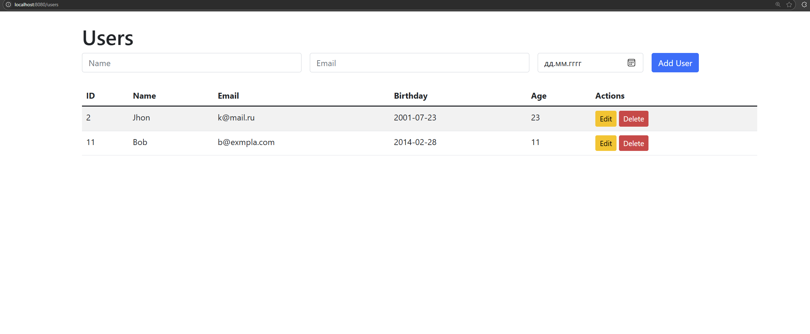

## CRUD Web приложение
Проект представляет собой простое CRUD веб-приложение, созданное при помощи Spring Boot, Hibernate JPA. Используемая СУБД - PostgreSQL. Создано несколько юнит-тестов. Проект сделан в рамках отработки навыков работы с Spring Boot, PostgreSQL, Hibernate и JUnit.
